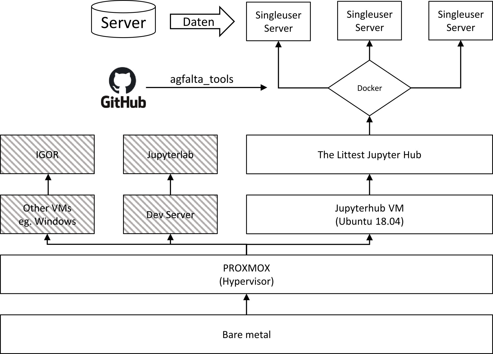

# µspy deployment

<p align="center">
  
</p>

This repo contains setup scripts and configuration files for deploying code on the agfalta jupyter server.


## Developing

For developing `uspy`, look at the documentation [here](dev/README.md). When you have tested your code changes in your local container, you can commit them to `uspy` and push to github. After that, you can update the version running on the server (next section).


## Updating the server

To use the newest `uspy` version on the jupyterhub, log into the jh server via ssh and clone this deployment repository there:

```sh
$ ssh xxx@jupyterhub.server
$ git clone git@github.com:surf-sci-bc/deployment.git
```

Then, go into the deployment directory. To build a new docker container from the most recent `uspy` commit and push it for use in Jupyterhub, just use the make target:

```sh
$ cd deployment
$ make update
```


## Updating the Jupyterhub container itself

If you want to apply changes to the JH config, first follow the instructions from the last paragraph except for the last command. Then, do `$ make jh-restart` instead of update. This rebuilds the JH container, restarts it and the docker registry.


## GPAW and quantum-espresso

Both packages are installed in the jupyterhub image. For more information see the [gpaw](https://wiki.fysik.dtu.dk/gpaw/index.html) and [QUANTUMESPRESSO](https://www.quantum-espresso.org/) websites.

The dependencies for both can be complicated, but QE is available through `apt`. For gpaw, the pseudopotential data needs to be downloaded via `gpaw install-data <dir>` (see [here](https://wiki.fysik.dtu.dk/gpaw/install.html)). In the single user JupyterHub containers, it is located in `$HOME/surfer-analysis/jupyter-data/gpaw_potentials`. In the current setup, `$HOME/surfer-analysis/` points to the surfer's mounted analysis directory (`/mnt/analysis`).

To set this up, you have to execute `jupyterhub/gpaw/install_gpaw.sh`. It places a `rc.py` in each user's `$HOME/.gpaw` directory so that gpaw actually knows the correct path.

